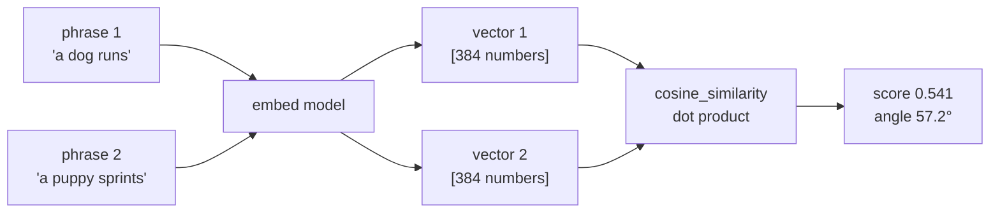
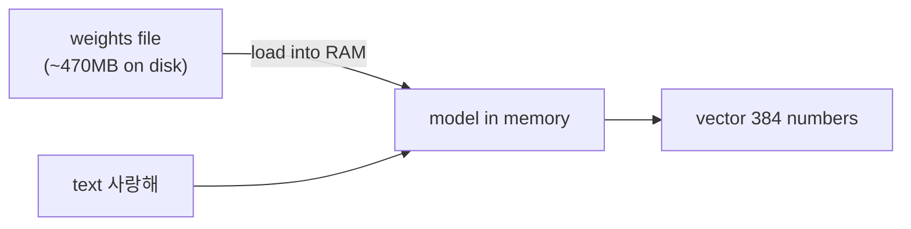
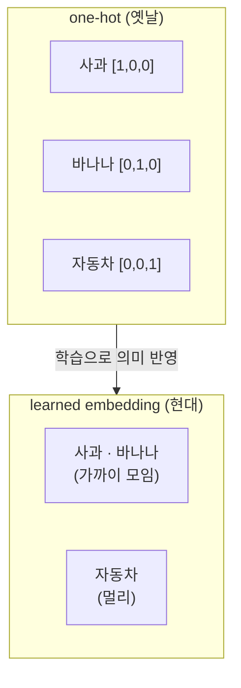
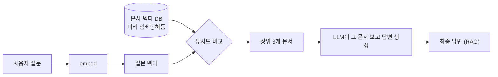
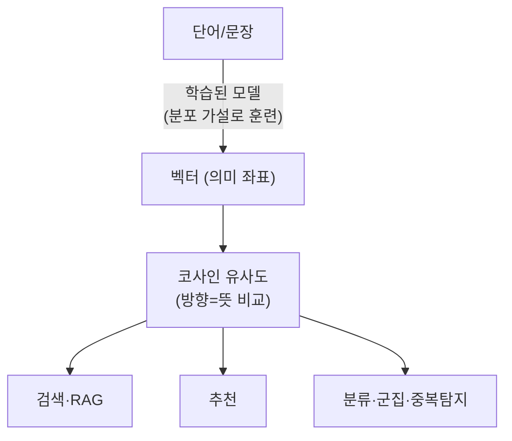

# Context Management — 내 학습 노트

이 모듈의 실습 스타터 `embedding-similarity`(임베딩 코사인 유사도 놀이터)를 직접
돌려보며, **문장을 숫자로 바꿔 의미의 닮음을 재는** 임베딩의 원리와 활용을 공부했다.
아래 내 노트는 관련된 슬라이드 밑에 사이사이 붙여 두었다. (앱: 문장 두 개 → 코사인
유사도. API 키 없이 로컬 멀티링구얼 모델만 사용.)

### 이번에 배운 것 (한눈에)
- 임베딩 = 문장을 **의미 좌표(벡터)**로 바꾼 것. 코사인 유사도는 두 벡터의 *방향*을
  비교(길이는 무시)해 -1~1로 닮음을 잰다.
- `normalize_embeddings=True`로 길이를 1로 맞추면 코사인 유사도 = 단순 **내적**.
- 멀티링구얼 모델은 언어가 달라도 *뜻*이 같으면 높은 점수(cat↔고양이 0.989).
- 임베딩 모델은 LLM보다 훨씬 작아 **GPU 없이 CPU로** 충분히 빠르다(추론은 1회 통과).
- 의미 검색: '환불'이란 단어가 없는 문서도 *뜻*으로 잡아낸다 → RAG의 검색 엔진.
- 단어 산수(king − man + woman ≈ queen)가 실제로 동작 → 임베딩은 의미의 *구조*를 담음.

@slide-7

### 큰 그림: "뜻을 좌표로 바꿔서 각도를 잰다"

문장을 지도 위의 **화살표(벡터)**라고 생각하자. 뜻이 비슷한 문장은 화살표가 같은 쪽을
가리키고, 상관없는 문장은 직각으로 어긋난다. 이 앱이 하는 일은 딱 두 단계다.

1. 문장 → 화살표로 변환 (`embed`)
2. 두 화살표가 벌어진 **각도**를 잰다 (`cosine_similarity`)



**💡 인사이트**
- **왜 `@` 하나로 끝나나?** `similarity.py`에서 `normalize_embeddings=True`로 모든
  화살표 길이를 1로 맞췄다. 길이가 1이면 코사인 유사도 = 그냥 **내적(dot product)**
  이라, `va @ vb` 한 줄이 전부가 된다. 수학적 지름길.
- **전역 캐시 패턴**: `get_model()`은 모델(~470MB)을 한 번만 로드하고 `_model`에
  저장한다. 매번 다시 안 부르려는 흔한 lazy-singleton 패턴.
- **숫자→각도 변환**: `acos`로 코사인을 각도(°)로 되돌려 보여준다. "0.54"보다
  "57도 벌어짐"이 직관적이라 학습용으로 더 와닿는다. `max(-1, min(1, cos))`는
  부동소수점 오차로 1.0000001 같은 값이 나와 `acos`가 터지는 걸 막는 안전장치.

### 앱 코드 4부분

| 함수 | 역할 | 비유 |
|------|------|------|
| `get_model()` | 모델 1회 로드·캐싱 | 무거운 사전을 책상에 한 번만 꺼내둠 |
| `embed(a,b)` | 문장 2개 → 벡터 2개 | 문장을 좌표로 번역 |
| `cosine_similarity()` | 두 벡터 내적 | 두 화살표 각도 재기 |
| `repl()` / `main()` | 입력 받아 실행 | 대화창 / 진입점 |

### "Loading weights"가 뭐고, 왜 GPU 없이 바로 도나

실행할 때 뜨는 `Loading weights: 199/199`는 **임베딩 모델을 메모리로 불러오는 중**이란 뜻.

**"weights(가중치)" = 모델이 학습으로 얻은 *기억* 그 자체.** 신경망은 거대한
**숫자 다이얼 뭉치**다. 학습이란 수억 개의 다이얼을 조금씩 돌려서 "이 문장은 이런 좌표"
라고 맞추게 만드는 과정이고, 다 돌려놓은 **다이얼 값들의 묶음이 곧 weights**다. 이 모델은
그게 199덩어리로 저장돼 있어 `199/199`로 표시된 것.



**💡 인사이트**
- **학습(training) vs 추론(inference)은 무게가 다르다.** 다이얼을 *돌려 맞추는* 학습은
  GPU 수십~수백 대로 며칠 걸린다. 하지만 우리가 하는 건 이미 맞춰진 다이얼로
  **곱셈·덧셈 한 번 통과**시키는 추론 — 훨씬 가볍다.
- **이 모델은 "작은" 축**(MiniLM, 384차원, ~470MB). 요즘 LLM(수백억 파라미터, 수십~
  수백 GB)에 비하면 장난감 크기라, 맥북 CPU로도 문장 하나 0.01초면 끝난다.
- **"빠른 로딩(0초)"의 진짜 이유**: weights가 이미 디스크에 받아져 있어 파일을 RAM으로
  복사만 하면 끝. 진짜 오래 걸리는 건 *최초 다운로드*(470MB)였고 그건 한 번만.

**왜 CPU로 충분한가 — 규모 비교**

| | 이 임베딩 모델 | 보통의 LLM (예: 챗봇) |
|---|---|---|
| 파라미터(다이얼 수) | ~1억 (작음) | 수백억~수천억 |
| 디스크 크기 | ~470MB | 수십~수백 GB |
| 하는 일 | 문장 → 벡터 (1회 통과) | 단어를 하나씩 수백 번 생성 |
| 필요 하드웨어 | **CPU로 충분** | 보통 GPU 필수 |

핵심은 **"임베딩은 한 번 통과시켜 좌표 하나 뽑으면 끝"**이라 연산량이 작다는 것. 반면
챗봇 LLM은 단어를 한 개씩 수백 번 반복 생성해 무겁고, 그래서 GPU가 거의 필수다.

@slide-9

### 단어를 어떻게 숫자로 바꾸나 — "특징 설문지"

컴퓨터는 글자를 못 읽는다. 그래서 단어마다 **특징 점수표**를 만든다고 상상하자.
단어를 4개 항목으로 채점한다면:

| 단어 | 살아있음? | 왕족? | 남성성 | 크기 |
|------|----------|-------|--------|------|
| king | 0.9 | 0.95 | 0.8 | 0.6 |
| queen | 0.9 | 0.95 | -0.8 | 0.55 |
| dog | 0.9 | 0.0 | 0.1 | 0.3 |
| rock | -0.9 | 0.0 | 0.0 | 0.4 |

이 점수 줄(`[0.9, 0.95, 0.8, 0.6]`)이 바로 **임베딩 벡터**다. king과 queen은 줄이
거의 같고(왕족성은 같고 남성성만 반대), rock은 완전히 딴판이다. 실제 모델은 항목이
**384개**고, 각 항목이 사람 말로 딱 떨어지진 않는다(기계가 정한 추상 축). 발상은 똑같다 —
**단어 = 여러 특징 점수의 묶음**.

**왜 "학습된" 임베딩인가 (옛날 방식의 한계).** 가장 단순한 방법은 **사전 번호표**
(one-hot) — "사과=1번, 바나나=2번..." 식으로 칸 하나만 1. 그러면 **사과와 바나나의
닮음 = 사과와 자동차의 닮음 = 0**(전부 직각)이라 의미가 1도 안 담긴다. 그래서
**데이터로 학습해서** 의미가 가까운 단어는 좌표도 가깝게 배치한 게 현대 임베딩이다.



**어떻게 학습하나 — "함께 다니는 단어를 보면 뜻을 안다"** (언어학의 *분포 가설*).
"나는 아침에 ___를 마셨다"의 빈칸엔 커피·차·물·주스가 들어간다. 모델은 거대한 텍스트를
훑으며 **"주변 단어로 가운데 단어 맞히기"** 퀴즈를 수억 번 푼다. 커피와 차가 늘 비슷한
빈칸에 들어가니 둘의 좌표를 점점 가깝게 민다. **함께 쓰이는 패턴만 보고 스스로** 의미
지도를 그리는 것.

**💡 인사이트**
- **사람이 정의를 안 적어준다.** "고양이는 동물"이라 라벨 붙인 적 없는데 '고양이'와
  '강아지'가 비슷한 문맥에 나오니 알아서 가까워진다.
- **그래서 편향도 학습된다.** 텍스트의 사회적 편견(특정 직업↔성별 등)도 좌표에 새겨진다.
  임베딩의 유명한 윤리 이슈.
- **언어가 달라도 통하는 이유**(이 모델): 학습 때 여러 언어를 *같은 좌표 공간*에
  욱여넣어, "cat"과 "고양이"가 같은 자리에 떨어지게 만들었다.

### 직접 돌려본 결과 해석 (사랑해 / king / i love you)

**`vec(...)`** = 그 문장의 화살표(앞 5개 숫자 미리보기), **`angle`** = 벌어진 각도,
**`cosine`** = 0~1 점수.

- **`사랑해` vs `너 싫어` → 0.437 (64.1°)** — 반대 감정인데 0이 아니다. 둘 다
  **"나↔너 사이 감정 표현"**이라는 같은 주제라서. 임베딩은 *감정 방향*보다 *무슨 얘기를
  하는지*를 더 강하게 잡는다.
- **`king` vs `queen` → 0.694 (46.1°)** — 셋 중 최고. 둘 다 "왕족"이라 가깝지만, 성별
  차이 때문에 1.0은 아님. **"관련 깊지만 같진 않음"**의 전형.
- **`i love you` vs `i hate you` → 0.426 (64.8°)** — ①의 영어 쌍둥이. 점수·각도가
  ①과 거의 똑같다. **같은 구조면 언어가 달라도 같은 패턴** → 모델이 *뜻*을 본다는 증거.

**💡 인사이트**
- **각도 ↔ 점수 감각**: 0° = 똑같음(1.0), 90° = 무관(0.0). 64°는 "절반쯤 어긋남".
- **숫자 5개는 맛보기**: 실제 화살표는 384차원. 앞 5개만 보여주고 계산은 384개 전부로.

### 실제로 본 임베딩의 성질 (데모)

`embedding-similarity` 모델로 직접 돌려본 결과.

**데모 A — 똑같은 문장 = 정확히 1.0000.** 같은 문장은 같은 화살표라 각도 0°, 점수 1.0.
유사도 점수의 **천장이 1**이라는 기준점.

**데모 B — 점수가 의미에 따라 계단처럼 내려감.**
```
기준: "강아지가 공원에서 뛴다"
0.972  공원에서 개가 달린다     ← 거의 같은 뜻
0.186  주식 시장이 폭락했다     ← 완전 무관
0.049  고양이가 소파에서 잔다   ← 동물이지만 장면이 정반대
```
"고양이가 소파에서 잔다"(0.049)가 "주식"(0.186)보다 **더 낮게** 나왔다. "둘 다 동물이니
비슷하겠지" 예상과 다르다. 모델은 단어(동물)보다 **전체 장면**(밖에서 뛴다 vs 안에서
잔다)을 더 무겁게 본 것.

**데모 D — 그 유명한 "단어 산수".**
```
king - man + woman ≈ ?
0.727  queen      ← 1등!
0.626  princess
0.002  boy
```
`왕 − 남자 + 여자 = 여왕`. 벡터를 빼고 더했더니 진짜로 queen이 1등. "왕족성은 유지하고
성별만 바꾼다"는 의미 연산이 좌표 공간에서 산수로 가능하다 — 임베딩이 단순 사전이 아니라
**의미의 구조**를 담고 있다는 결정적 증거. ("남→여" 변화가 좌표 공간의 *일정한 방향*으로
존재해서, actor→actress 같은 다른 짝에도 같은 방향이 통한다.)

@slide-10

### 벡터 stores — 가까운 벡터를 빠르게 찾기

**💡 인사이트**
- 문서가 수백만 개면 매번 전부 비교가 느리다. 그래서 Pinecone·FAISS·pgvector 같은
  *벡터 데이터베이스*가 "가까운 벡터 빠르게 찾기"를 전담한다. 이 앱(`similarity.py`)은
  그 축소판 — 문서 몇 개를 그냥 반복 비교하는 수준.
- **임베딩은 미리 계산(캐시)해둔다.** 문서 100만 개를 매번 임베딩하면 느리니, DB에
  벡터를 저장해두고 질문만 그때그때 임베딩한다.

@slide-12

### 유사도를 어디에 쓰나 (활용 지도)

"닮음을 숫자로 잰다"는 능력은 검색 말고도 곳곳에 쓰인다.

| 활용 | 어떻게 | 예시 |
|------|--------|------|
| **의미 검색 / RAG** | 질문 벡터와 문서 벡터들 비교 → 상위 N개를 LLM에 전달 | 사내 문서 챗봇 |
| **추천** | 내가 본 상품 벡터와 가까운 상품 추천 | "이 영화와 비슷한 영화" |
| **분류 (zero-shot)** | 문장 벡터를 후보 라벨 벡터들과 비교, 최근접 라벨 선택 | 문의 메일 긴급/일반 분류 |
| **중복·표절 탐지** | 두 글의 벡터가 너무 가까우면 중복 | 커뮤니티 도배글 차단 |
| **군집화(clustering)** | 가까운 벡터끼리 묶음 | 고객 후기 1만 개 → 주제별 그룹 |
| **이상 탐지** | 다른 것들과 멀리 떨어진 벡터 = 이상치 | 스팸·비정상 로그 |

**데모 C — 의미 검색(semantic search), RAG의 검색 단계.**
```
질문: "환불 받고 싶어요"
0.925  결제 취소 및 환불 절차 안내
0.904  주문한 상품을 반품하고 돈을 돌려받는 법   ← '환불'이란 단어가 없는데도 잡힘!
0.877  회원 가입 방법 안내
0.727  배송은 보통 2~3일 걸립니다              ← 제일 무관, 맨 아래
```
"주문한 상품을 반품하고 돈을 돌려받는 법"엔 **'환불'이라는 단어가 한 글자도 없는데**
2등으로 잡혔다. 키워드 검색(`Ctrl+F`)이면 절대 못 찾는다. 임베딩은 글자가 아니라
**뜻**으로 찾으니 가능한 것.



**💡 인사이트 — RAG의 한 줄 요약**: "질문과 가까운 문서 몇 개 찾아서(임베딩 유사도) →
그걸 LLM에게 읽혀서 답하게 함." 임베딩이 *검색* 담당, LLM이 *작문* 담당. 이전 모듈
(`extract_proposal`)이 LLM, 이번 모듈이 검색 — 둘이 합쳐지면 RAG가 된다.

**한 장 요약**



@slide-14

### 직관을 배신한 검색 결과 (왜 retrieval이 실패하나)

검색이 엉뚱한 문서를 물어오는 이유는, 임베딩이 **감정·정답 여부보다 *주제*를 더 보기**
때문이다. 오늘 직접 확인한 두 가지:

- **"반대말이면 점수가 낮겠지" → 아니다.** `사랑해` vs `너 싫어` = 0.44. 그래서 "환불
  하고 싶어요" 질문에 "환불 **안 됩니다**" 문서가 딸려온다 — 둘 다 *환불*이 주제라서.
- **"같은 동물이니 비슷하겠지" → 아니다.** `강아지가 공원에서 뛴다` vs `고양이가 소파에서
  잔다` = 0.049로 매우 낮음. 모델은 단어보다 *전체 장면*을 본다.

**💡 인사이트**: 검색에서 중요한 건 점수의 절대값이 아니라 *순위*다. RAG는 "상위 3개만
LLM에 넘긴다" 식이라, 1등과 꼴등의 *상대 거리*만 맞으면 된다. 그래서 위 같은 함정을
줄이려면 chunking·재순위(re-ranking)·질문 재작성 같은 장치를 덧댄다.

@slide-19

### 다음 할 일 (후보)
- 이 앱을 **미니 의미 검색기**로 확장(문서 여러 개 + 질문 → 순위 매기기, 데모 C를 코드로).
- 단어 임베딩 vs 문장 임베딩 차이 파보기.
- 벡터 DB의 빠른 탐색 원리(근사 최근접 탐색, ANN) 알아보기.
- 임베딩 편향 윤리 이슈 살펴보기.
