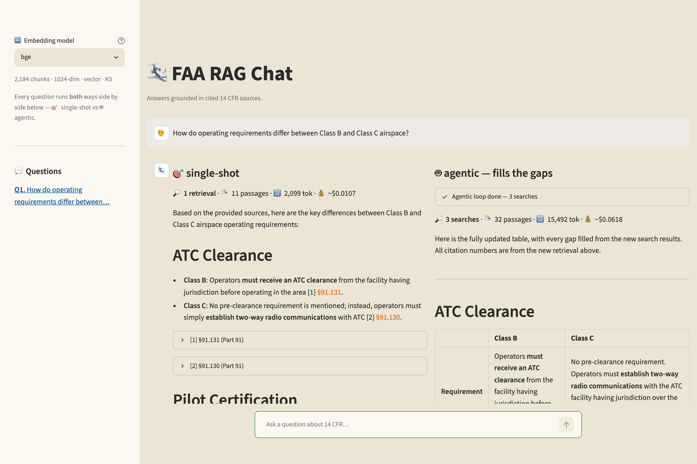
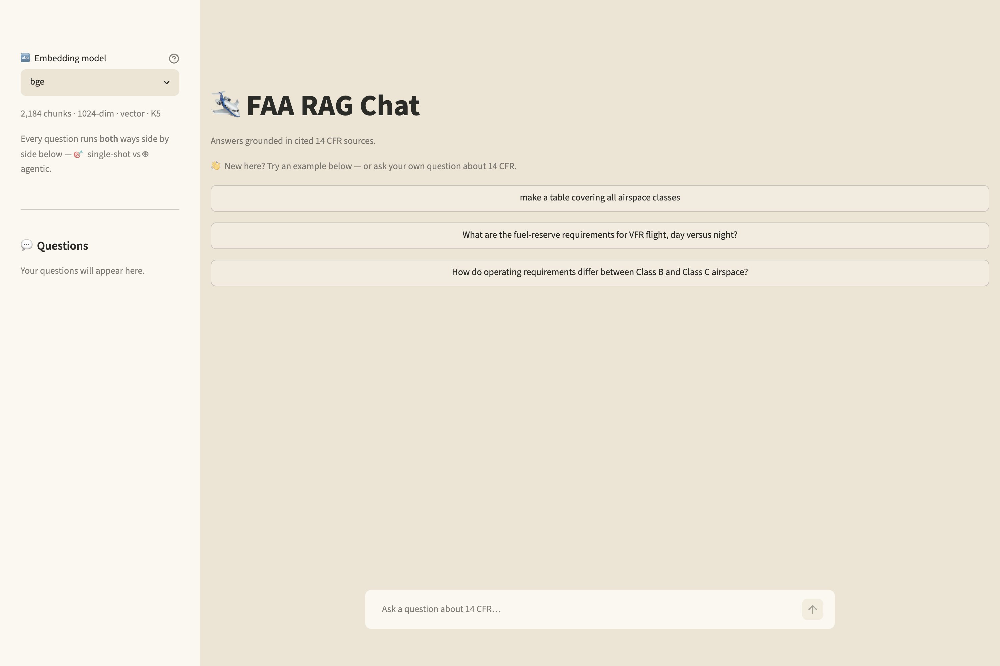
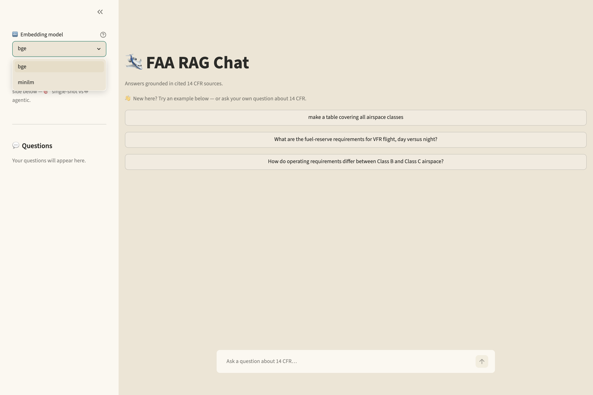
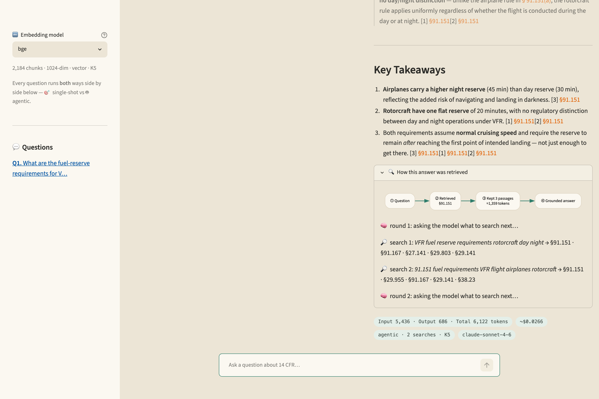
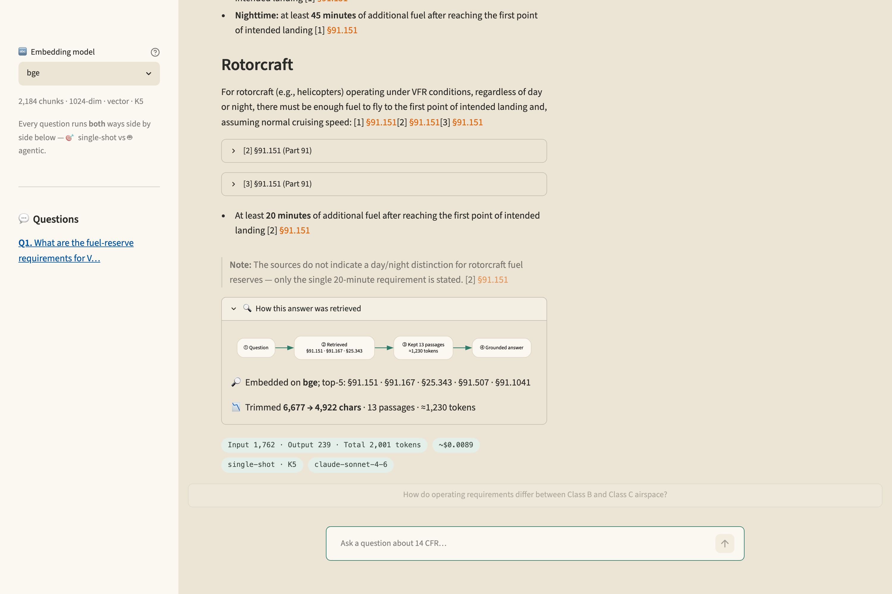
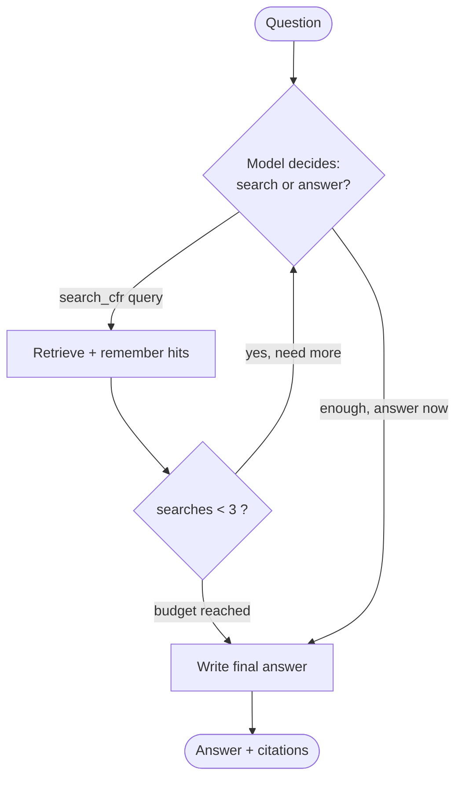
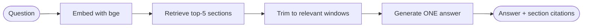

<a id="top"></a>

🌐 **한국어** · [English ↓](#english)

# 🛩️ FAA RAG Chat — 항공법(14 CFR) 챗봇

> 미국 연방항공규정(14 CFR)을 근거로 답하는 **RAG 챗봇**입니다. 질문 1건을 **단발(single-shot)** 과 **에이전틱(agentic)** 두 방식으로 나란히 응답하고, 실제 조항 번호(예: `§91.151`)로 인용합니다. 대회 출품용으로 개발했습니다.

**개요.** 오픈북 시험과 같이, 모델은 관련 법 조항을 검색해 읽고 **그 근거로만** 답합니다. 이로써 환각을 방지하고 인용을 검증할 수 있습니다.

---

## 📸 데모

질문 1건에 대해 **🎯 단발 / 🤖 에이전틱** 응답을 나란히 비교합니다.



<table>
<tr>
<td width="50%"><br><sub><b>초기 화면</b> — 모델 선택 · 예제 질문</sub></td>
<td width="50%"><br><sub><b>모델 선택</b> — bge ⇄ minilm 실시간 전환</sub></td>
</tr>
<tr>
<td width="50%"><br><sub><b>에이전트 과정</b> — 모델이 스스로 반복 검색(round별 트레이스)</sub></td>
<td width="50%"><br><sub><b>숫자 답변 예</b> — 연료 예비량: 낮 30분 · 밤 45분 [§91.151]</sub></td>
</tr>
</table>

**라이브 문서·발표자료** (별도 사이트에 배포):
- 프로젝트 개요·실험·작업일지 — <https://welovecherry.github.io/ksept-lab/rag-project.html>
- 발표 슬라이드 — <https://welovecherry.github.io/ksept-lab/rag-slides.html>

---

## ✨ 개념 — 오픈북 시험 비유

모델(학생)은 항공법을 사전에 학습하지 않습니다. 대신 검색기(사서)가 질문과 관련된 조항을 선별해 제공하면, 모델은 **제공된 조각만 근거로** 답을 작성하고 출처를 인용합니다.

- **RAG** = Retrieval(검색) + Augmented Generation(생성). "먼저 검색하고, 그 근거로 생성한다"는 구조입니다.
- **청크(chunk)** = 긴 법 원문을 검색 단위로 자른 조각. 전체 코퍼스는 **2,184개** 청크로 구성됩니다.

---

## 🧩 두 개의 엔진

| 구분 | 🎯 단발 (single-shot) | 🤖 에이전틱 (agentic) |
|---|---|---|
| **검색 주도권** | 코드가 통제(1회 고정) | **모델**이 결정(최대 3회) |
| **비용** | 낮고 일정(~2,100 토큰) | 검색 횟수에 비례 증가(~15,000 토큰) |
| **강점** | 구체적 질문에 신속·정확 | **여러 조항에 걸친** 질문 · 자가교정 |
| **기본값** | ✅ 기본 | 교차조항 질문 시 선택 |

> 초기에는 단발만 구현했고, 이후 에이전트를 추가했습니다. 현재는 두 방식을 함께 제공합니다. 대회의 비용 항목을 고려해 단발을 기본값으로 두되, 범위가 넓은 질문에서는 에이전트가 우위를 가집니다.

---

## 🔎 동작 방식

**단발 RAG — 단일 경로(배포 기본값):**


**에이전틱 — 모델 주도 반복 검색(검색 3회 상한):**



핵심 차이는 통제권에 있습니다. 단발은 코드가 검색을 1회 통제하고, 에이전틱은 모델이 "추가 검색 여부"와 "응답 시점"을 스스로 결정합니다.

---

## 🏆 검색 챔피언

임베딩 4종 × 청킹 2종 × 검색 3종 × K 3종 = **45개 조합**을 11개 문제로 채점했습니다. 결과는 다음과 같습니다.

| 설정 | coverage | MRR(순위) | 토큰/질문 |
|---|:---:|:---:|:---:|
| ⭐ **추천** — section · bge · **vector** · **K5** | 0.818 | **0.718** (최고) | **10,802** (~38%↓) |
| 🥇 최고 정확도 — section · bge · hybrid · K8 | **0.864** | 0.636 | 17,284 |

- **§ 단위 청킹**: 법령은 조항 단위로 완결되므로, 글자수보다 조항 경계 분할이 유리합니다.
- **bge 임베딩**: 영어 검색에 특화된 1024차원 모델로, 작은 K에서도 정답을 상위에 배치해 토큰을 절감합니다.
- 상세 방법·결과: [`EXPERIMENTS.md`](EXPERIMENTS.md) · [`STRATEGY.md`](STRATEGY.md)

---

## 🚀 빠른 시작

```bash
cd rag-starter

# 1) 가상환경 + 의존성
python3 -m venv .venv && source .venv/bin/activate
pip install -r backend/requirements.txt -r ../harness/requirements.txt

# 2) API 키 설정 (Anthropic)
cp .env.example .env          # .env 에서 ANTHROPIC_API_KEY 입력

# 3) 인덱스 생성 (문서 → 청크 → 임베딩)
python indexer.py

# 4) 컴페어 앱 실행 (단발 vs 에이전틱)
streamlit run streamlit_app.py
```

> 키는 `.env`에만 보관하며 커밋하지 않습니다. 최초 실행 시 bge 모델을 메모리에 적재하므로 지연이 발생합니다(재다운로드가 아닙니다).

---

## 🗂️ 프로젝트 구조

```
rag-contest/                 # (별도 리포로 분리 시 루트)
├── rag-starter/             # 앱
│   ├── indexer.py               # 문서 → 청크 → 임베딩 인덱스
│   ├── streamlit_app.py         # 단발 vs 에이전틱 비교 UI
│   └── backend/                 # Flask 인용 API (app.py)
├── harness/                 # 검색 엔진 + 실험 오케스트레이터 + 채점기
├── corpus/                  # 원본 FAA PDF (6개, 14 CFR)
├── experiments/             # 실험 결과 스트림 (jsonl · 리더보드)
├── assets/screenshots/      # README 데모 이미지
├── CONTEST.md               # 대회 규칙
├── STRATEGY.md              # 전략 (로드맵)
├── EXPERIMENTS.md           # 실험 런북
└── DESIGN.md                # 설계 노트
```

---

## 📚 참고 문서

| 문서 | 내용 |
|---|---|
| [`CONTEST.md`](CONTEST.md) | 대회 규칙 · 채점표 · 연습문제 |
| [`STRATEGY.md`](STRATEGY.md) | 전체 전략 · 3막 구조 · 로드맵 |
| [`EXPERIMENTS.md`](EXPERIMENTS.md) | 실험 계획 · 홀드아웃 · 비용 정책 |
| [`DESIGN.md`](DESIGN.md) | 설계 결정 노트 |
| [라이브 문서](https://welovecherry.github.io/ksept-lab/rag-project.html) | 개요 · 용어사전 · 실험 · 작업일지 (웹) |

<br>

---

<a id="english"></a>

🌐 [한국어 ↑](#top) · **English**

# 🛩️ FAA RAG Chat — FAA 14 CFR Chatbot

> A **RAG chatbot** that answers questions grounded in the U.S. Federal Aviation Regulations (14 CFR). Each question is answered **two ways side by side** — **single-shot** and **agentic** — and cited with real section numbers (e.g., `§91.151`). Built for a contest.

**Overview.** Like an open-book exam, the model retrieves and reads the relevant regulation sections and answers **only from that evidence**. This prevents hallucination and keeps every citation verifiable.

---

## 📸 Demo

For one question, the app compares **🎯 single-shot** and **🤖 agentic** answers side by side.


<table>
<tr>
<td width="50%"><br><sub><b>Initial screen</b> — model picker · example questions</sub></td>
<td width="50%"><br><sub><b>Model picker</b> — switch bge ⇄ minilm live</sub></td>
</tr>
<tr>
<td width="50%"><br><sub><b>Agentic process</b> — model searches repeatedly on its own (per-round trace)</sub></td>
<td width="50%"><br><sub><b>Numeric answer</b> — fuel reserve: 30 min day · 45 min night [§91.151]</sub></td>
</tr>
</table>

**Live docs & slides** (deployed on a separate site):
- Project overview, experiments, worklog — <https://welovecherry.github.io/ksept-lab/rag-project.html>
- Presentation slides — <https://welovecherry.github.io/ksept-lab/rag-slides.html>

---

## ✨ Concept — the open-book exam

The model (the student) never studied aviation law in advance. Instead, a retriever (the librarian) selects the sections relevant to the question, and the model writes its answer **using only those passages**, citing the sources.

- **RAG** = Retrieval + Augmented Generation: "retrieve first, then generate from that evidence."
- **Chunk** = one small, searchable piece of the law. The full corpus is **2,184** chunks.

---

## 🧩 Two engines

| | 🎯 single-shot | 🤖 agentic |
|---|---|---|
| **Who drives search** | our code (fixed, 1×) | the **model** (up to 3×) |
| **Cost** | low & flat (~2,100 tokens) | grows with searches (~15,000 tokens) |
| **Strength** | fast & precise on specific questions | questions spanning **many sections** · self-correction |
| **Default** | ✅ default | chosen for cross-section questions |

> Single-shot was built first; the agent was added later. Both are now offered together. Single-shot is the default because of the contest's cost criterion, while the agent wins on broad, cross-section questions.

---

## 🔎 How it works

**Single-shot RAG — a straight line (deployed default):**



**Agentic — model-driven repeated search (capped at 3):**


The key difference is control. Single-shot lets our code run one search; agentic lets the model decide whether to search again and when to answer.

---

## 🏆 Retrieval champion

45 configurations (4 embeddings × 2 chunkings × 3 search methods × 3 K values) were scored on 11 questions.

| Config | coverage | MRR (rank) | tokens/question |
|---|:---:|:---:|:---:|
| ⭐ **Recommended** — section · bge · **vector** · **K5** | 0.818 | **0.718** (best) | **10,802** (~38% less) |
| 🥇 Top accuracy — section · bge · hybrid · K8 | **0.864** | 0.636 | 17,284 |

- **Section-boundary chunking**: regulations are self-contained per section, so cutting on section boundaries beats fixed character counts.
- **bge embedding**: an English-focused 1024-dim model that ranks the right answer high even at small K, saving tokens.
- Details: [`EXPERIMENTS.md`](EXPERIMENTS.md) · [`STRATEGY.md`](STRATEGY.md)

---

## 🚀 Quick start

```bash
cd rag-starter

# 1) venv + dependencies
python3 -m venv .venv && source .venv/bin/activate
pip install -r backend/requirements.txt -r ../harness/requirements.txt

# 2) API key (Anthropic)
cp .env.example .env          # set ANTHROPIC_API_KEY in .env

# 3) build the index (documents → chunks → embeddings)
python indexer.py

# 4) run the compare app (single-shot vs agentic)
streamlit run streamlit_app.py
```

> Keep the key in `.env` only and never commit it. The first run loads the bge model into memory, which takes a moment (it is not re-downloading).

---

## 🗂️ Project structure

```
rag-contest/                 # (the root when split into its own repo)
├── rag-starter/             # app
│   ├── indexer.py               # documents → chunks → embedding index
│   ├── streamlit_app.py         # single-shot vs agentic compare UI
│   └── backend/                 # Flask citation API (app.py)
├── harness/                 # retrieval engine + experiment orchestrator + scorer
├── corpus/                  # source FAA PDFs (6 files, 14 CFR)
├── experiments/             # experiment result streams (jsonl · leaderboards)
├── assets/screenshots/      # README demo images
├── CONTEST.md               # contest rules
├── STRATEGY.md              # strategy (roadmap)
├── EXPERIMENTS.md           # experiment runbook
└── DESIGN.md                # design notes
```

---

## 📚 Further reading

| Doc | Contents |
|---|---|
| [`CONTEST.md`](CONTEST.md) | rules · rubric · practice questions |
| [`STRATEGY.md`](STRATEGY.md) | full strategy · three acts · roadmap |
| [`EXPERIMENTS.md`](EXPERIMENTS.md) | experiment plan · holdout · cost policy |
| [`DESIGN.md`](DESIGN.md) | design decision notes |
| [Live docs](https://welovecherry.github.io/ksept-lab/rag-project.html) | overview · glossary · experiments · worklog (web) |
